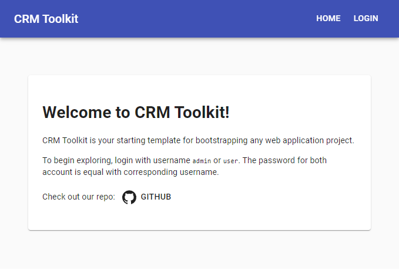
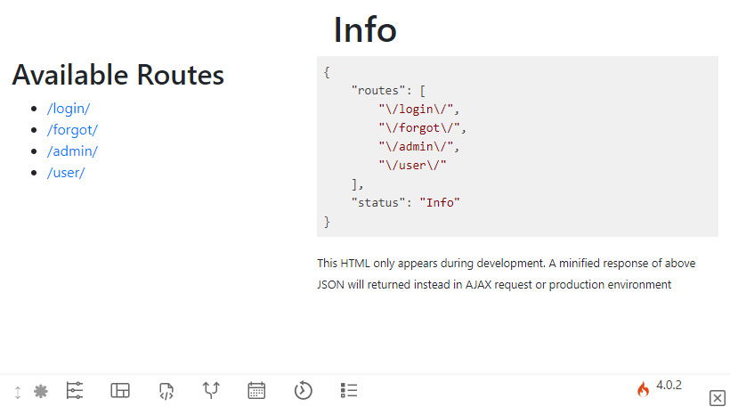

# Know the Basics

## Introduction

When you want to start developing a web application, you'll always want to stick with MVC principle. Be it a small or big, CRM-Toolkit has you covered to get start up quick. It builds upon three libraries: CodeIgniter, React, Material-UI. You can read why it's a perfect mix in the [README](https://github.com/willnode/crm-toolkit#readme) file.

## Motivation

Personally, I have done work in web apps over a large number of clients. To get hook in quickly, I have prepared a small template to keep. However, over time it keep bigger and better. I know which component is needed and which one isn't. At first thought I was  think that [PHP-only code](https://github.com/willnode/cms-toolkit-with-coreui) is enough but now here I landed in CRM-Toolkit and now I use it for most of cool web apps I develop.

When you understand how modern web apps work, you'll love how this repo helps you to get boot up on developing web apps fast.

## File Structure

When you clone this repo, this file structure applies:

```
+ root           -----> Root Project
|--+ api         -----> CodeIgniter (Server)
|  |--+ app      -----> Your Server Logic
|  |--+ writable -----> User Generated Contents
|  |.......
|--+ web         -----> Create-React-App (Client)
|  |--+ public   -----> All Static Files
|  |--+ src      -----> Your Client App
|  |.......
|..........
```

The `api` is a CodeIgniter4 project for the server code, while `web` is a Create-React-App project for the client code.

If you don't know the difference, when deployed, the `api` code runs on your host server while `web` code runs on the browser.

> Note that I really recommends you to look at each documentation [here](https://codeigniter4.github.io/CodeIgniter4/), [here](https://create-react-app.dev/) and [here](https://material-ui.com/) if you haven't familiar with those frameworks. It's important to note that this article series is not a subtitute to each corresponding documentation; you need to understand basic principles on how they work, how they get used so that you can harness it's full power.

## Installing

When we `install`, we're referring to preparing your computer to run the app there. For the server you need `PHP` atleast 7.2, and be registered on your terminal (so that you can run `php` directly on it). You also need `MariaDB` server running with an empty database named `crmtoolkit` (you can configure this name later) with collation [utf8mb4_unicode_ci](). After everything ready, you can call the database migration:

```
$/api> php spark migrate
```

That will create a `login` table required to run the server. (See also [relevant docs](https://codeigniter4.github.io/CodeIgniter4/dbmgmt/migration.html)).

For the client you need to install latest `Node.JS`, then run `npm install` on web folder.

```
$/web> npm install
```

That will fetch additional JS modules required to run the app (Including `Material-UI`). The process might take a while for first run.

> Note that I am not covering on how to actually achieve these steps technically, or this article would be very long to read. You can quickly google how to do each step.

## Running

The running step should be easy.

```
$/api> php spark serve
$/web> npm start
```

That action opens `localhost:4000` for server API and `localhost:3000` for the client App.

If you ask why there's two different endpoint, that's because CRM-Toolkit introduces separation between server and client code. The client communicates to server using AJAX requests.

## Hello World

If you open `localhost:3000`, you get this:



*Yes, even the default template has a login mechanism.*

You can also open `localhost:4000` to explore the server:



The server has it's own `debugger` page. That's enabled only during development mode. With that you can explore your server endpoints directly in the browser. In production mode or AJAX requests this returns pure `JSON` instead.

## Next

+ Read [Designing the App](design.md)
+ Back to the [Main Page](index.md)