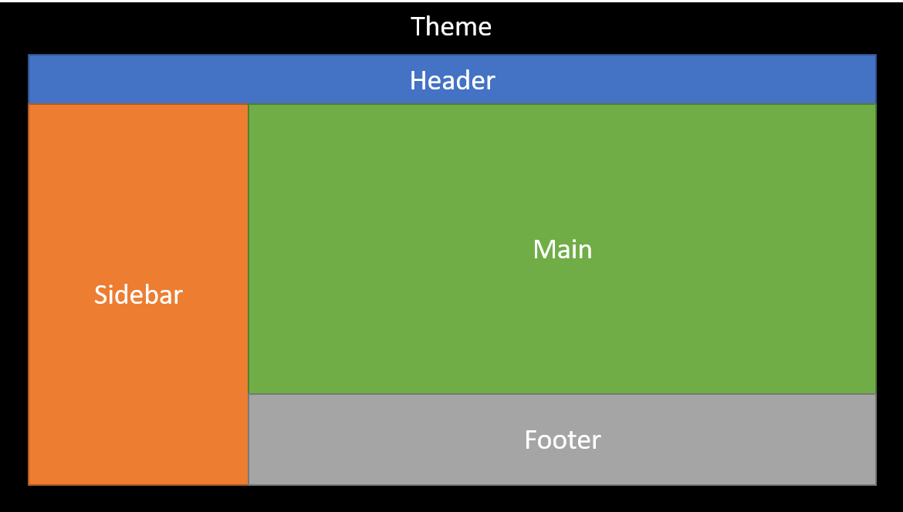

# Designing the App

In previous section you're able to run CRM-Toolkit on your local computer. Now it's time to bring your app idea alive without getting burden by common developer mistakes.

When developing an application, it's very recommended that you really take care **code consistency** and **reusability**. And to avoid common pitfalls, I discuss them in this specific order:

## Database

The database is the heart of your application. Nothing bugs developer more than a poorly designed database.

The good news is, CRM-Toolkit already includes login mechanism. That's the most basic stuff any web application must have. The rest of application content is up to you, the designer.

For completeness, we'll creating a web application that enables blogging for the rest of this article. Other web apps, even the most complex platform you can imagine, usually uses similar principle.

When you're migrating with `php spark migrate`, it creates `login` like this:

```sql
CREATE TABLE `login` (
	`login_id` INT(11)
		UNSIGNED NOT NULL AUTO_INCREMENT,
	`username` VARCHAR(255)
		NOT NULL,
	`email` VARCHAR(255)
		NOT NULL,
	`password` CHAR(60)
		NULL DEFAULT NULL,
	`otp` CHAR(6)
		NULL DEFAULT NULL,
	`name` VARCHAR(255)
		NOT NULL DEFAULT '',
	`avatar` VARCHAR(255)
		NOT NULL DEFAULT '',
	`role` ENUM('admin','user')
		NOT NULL DEFAULT 'user',
	`created_at` TIMESTAMP
		NOT NULL DEFAULT current_timestamp(),
	`updated_at` TIMESTAMP
		NOT NULL DEFAULT current_timestamp()
		ON UPDATE current_timestamp(),
	PRIMARY KEY (`login_id`),
	UNIQUE INDEX `username` (`username`),
	UNIQUE INDEX `email` (`email`)
);
```

You can read more about them [later]() as we'll only covers what's necessary to discuss.

For a table that hold articles, I would create a table like this:

```sql
CREATE TABLE `article` (
	`article_id` INT(11)
		UNSIGNED NOT NULL AUTO_INCREMENT,
	`article_login` INT(11)
		UNSIGNED NOT NULL,
	`article_title` VARCHAR(255)
		NOT NULL DEFAULT '',
	`article_body` TEXT
		NOT NULL DEFAULT '',
	`article_permalink` VARCHAR(255)
		NULL DEFAULT NULL,
	`created_at` TIMESTAMP
		NOT NULL DEFAULT current_timestamp(),
	`updated_at` TIMESTAMP
		NOT NULL DEFAULT current_timestamp()
		ON UPDATE current_timestamp(),
	PRIMARY KEY (`article_id`),
	UNIQUE INDEX (`article_permalink`),
	INDEX (`article_login`),
	CONSTRAINT FOREIGN KEY (`article_login`)
		REFERENCES `login` (`login_id`)
		ON UPDATE RESTRICT ON DELETE CASCADE
);
```

Now here's some keypoints:

+ The table name is singular.
+ All column (field) names uses `snake_case`.
+ The table's `PRIMARY KEY` should be  `table_name + "_id"`, also this field must be `AUTO_INCREMENT` hence should **never** be modified.
+ All other fields (except `created_at`/`updated_at`) are prefixed with `table_name` (the `login` table is **only** an exception).
+ Constraint keys should named like `table_name + constraint_table_name` and never be `nullable`
+ `UNIQUE` keys should always be `nullable`
+ Other attribute fields should never be `nullable` as long as it companied with a default value (empty string, 0, default enum, etc).
+ All fields that references other field **must** be constrained using `FOREIGN KEY`
+ All constraints should be `RESTRICT` on `UPDATE` (for `DELETE` it depends on context, [read notes]()).
+ For `INT` and `VARCHAR` length, use common number (11 and 255)

Also when designing relations. You should never have a table that holds `one-to-one` relationship. For instance, if you wanted profile customization like user description or website, you can just append them to login table like this:

```sql
ALTER TABLE `login`
	ADD COLUMN `description` TEXT
		NOT NULL DEFAULT '',
	ADD COLUMN `website` VARCHAR(255)
		NOT NULL DEFAULT '';
```

And for tables that holds `many-to-many` relationship, like between articles and tags, you should make **both** constraints as single `PRIMARY KEY`. The naming convention also bit rather complex, but I stick with `single_plural` convention, where the `single` belongs to the table that commonly have more rows (or in other word, the `plural` goes to a table which referred as `common groups`). This ends up following table:

```sql
CREATE TABLE `article_tags` (
	`article_id` INT(11)
		UNSIGNED NOT NULL,
	`tag_id` INT(11)
		UNSIGNED NOT NULL,
	`created_at` TIMESTAMP
		NOT NULL DEFAULT current_timestamp(),
	PRIMARY KEY (`article_id`, `tag_id`),
	INDEX (`article_id`),
	INDEX (`tag_id`),
	CONSTRAINT FOREIGN KEY (`article_id`)
		REFERENCES `article` (`article_id`)
		ON UPDATE RESTRICT ON DELETE CASCADE,
	CONSTRAINT FOREIGN KEY (`tag_id`)
		REFERENCES `tag` (`tag_id`)
		ON UPDATE RESTRICT ON DELETE CASCADE
);
```

That's being said, database convention is mostly opinionated, but these rules works for me pretty well. You can [read here]() if you curious the benefit and caveats of using these principles.

## Server

The server is the entry gate to your database. To make the server secure, you have to validate and sanitize every input comes from the web.

Luckily, CodeIgniter 4 are packed with lots of tools to make our server secure. And CRM-Toolkit can make this feels really seamless.

In `/api/app/Controllers/`, there are 3 public controllers defined:

```
+ Controllers
|--+ Admin.php
|--+ Home.php
|--+ User.php
```

`Home.php` is the "default" controller for every unauthenticated requests. By default it includes endpoints for `/login` and  `/forgot`. The other files `Admin.php` and `User.php` are controllers for authenticated request. The authentication is done using `Basic Auth` matching corresponding `username` and `password` in `login` table. If you wonder how to differentiate between `admin` and `user` login, that's done using `role` field in the table:

```sql
CREATE TABLE `login` (
	...
	`role` ENUM('admin','user')
		NOT NULL DEFAULT 'user',
	...
);
```

Now the interesting thing is that, each `role` is mutually exclusive each other. For instance, `admin` cannot accessing `/user` endpoint (otherwise it'll get `401 Unauthorized`). You might think that this against code reusability but actually it isn't, because most controllers are the defined this way:

```php
class Admin extends BaseController
{
	public function user($id = NULL)
	{
		return (new UserModel())->execute($id);
	}
}
```

*Yes, a single line of code for whole `/admin/user` endpoint.*

You can find these Models in `/api/app/Models/`:

```
+ Models
|--+ LoginModel.php
|--+ ProfileModel.php
|--+ UserModel.php
```

Why we have to design controllers this way? Because most CRUD models have the same principle. We're abstracting away those in form of models. This way, two endpoints like `/admin/profile` and `/user/profile` can share the same model `ProfileModel.php`.

This is not the only good news. If we want to create new endpoints for our blogging platform where `/user/article` gives access to articles which belongs to currently logged-in account, while `/admin/article` gives access to all available articles. We can do it like:

```php
class ArticleModel extends BaseModel
{
	// More options actually available
	// We only show things that essential here
	protected $table = 'article';
	protected $primaryKey = 'article_id';
	protected $select = [
		'article_id', 'article_login',
		'article_title', 'article_body'
	];
	protected $allowedFields = [
		'article_login',
		'article_title',
		'article_body'
	];

	private $login;

	function executeBeforeExecute($event)
	{
		// Pass $request, $builder
		extract($event, EXTR_REFS);
		// Get current login info
		$this->login = $request->login;

		if ($this->login->data->role === 'user') {
			// Limit access for "user" role
			// to only his content.
			// Note this also applies to
			// INSERT, UPDATE, DELETE
			$builder->where('article_login',
				$this->login->current_id);
		}
		return $event;
	}

	function executeBeforeChange($event)
	{
		// Pass $data, $method
		extract($event, EXTR_REFS);

		if ($this->login->data->role === 'user'
			&& $method !== DELETE) {
			// Whatever the changes,
			// 'article_login' must
			// be the current logged in
			// user account
			$data['article_login'] =
				$this->login->current_id;
		}
		return $event;
	}
}
```

More cool stuff can be discovered in the next page, but here we still need to tacke the most biggest challenge in design...

## Client

Let's be honest, creating a consistent yet interactive web application is still hard and most time-consuming task. So how CRM-Toolkit improves development in Client App?

The first thing that we need to consider is the page layout. I found out that most web layout is mostly divided into these sections:



Now the complexity reduces into, how much customization CRM-Toolkit can offers?

### Theme

### Header

### Sidebar

### Main

### Footer

## Next

+ Read [Designing the App](design.md)
+ Back to the [Main Page](index.md)